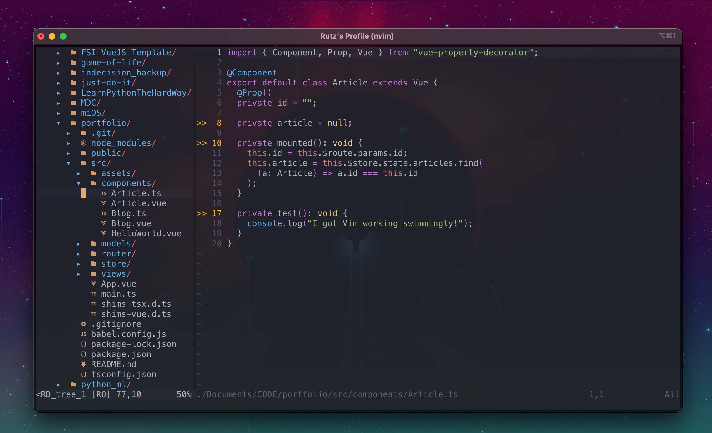

# how I learned Vim

## introduction

In this document, I'll share with you how I learned Vim, listing common commands and tips to help get you started with Vim. You should at least know what Vim is before reading this document. You should also know the basics of using a command prompt. (Also, I use NeoVim, but that shouldn't change any of the instructions/commands below.)

## launch / exit Vim
- type "vim" into your terminal of choice
- to open a file type "vim [path to file]
- to exit Vim, type ":q" and hit enter
- if you made changes to a document and want to save and quit: ":wq"
- if you want to discard changes: ":q!"

## modes

- normal - When you lanuch Vim, you'll be in normal mode, which is when you can use all the fancy key-bindings (keyboard shortcuts) that make Vim so special.
- insert - To actually type text, hit "i" or "a" and then start typing. (Try and figure out the difference between i and a.) Use escape to get back into normal mode.
- visual - Visual mode happens when you hit "v" in normal mode and you can use the arrow keys (or h, j, k, l) to select text. You'll need this for copying/pasting and bulk deleting, etc.
- command - You've already used command mode! When you hit ":" in normal mode you can type commands, like "w" to save or "q" to quit or "term" to open up a terminal window.

## commands

Now it's time to learn some handy commands that you can use in normal mode. Getting good at these things is what makes Vim folks to fast at writing code.

- hjkl
- o
- dd
- gg, G
- shift-{, shift-}
- 0, $
- crtl-ww
- ctrl-b
- :term

## .vimrc

The weirdest thing about Vim for most people is that it runs in a terminal. It's boring and ugly! So that's why people customize the heck out of their Vim windows. My setup literally looks like my VSCode window, except that it's faster to launch and faster to code in. The way to customize Vim is to edit the .vimrc file that lives in your home directory. If it's not there, you'll have to make it. I'll include my config file (for neovim, which is why it's called init instead of vimrc) in this repo so you can get a taste.

Plug is a plugin manager, so that's the first thing I install, then I use plug to install a bunch of plugins, and the last section of the file is where I set up settings for a bunch of different options, some that are built into Vim and some that are for the 

A word of advice: To get [NERDTree](https://github.com/preservim/nerdtree) to work with the [devicons](https://github.com/ryanoasis/vim-devicons) plugin, I had to install a ["nerd font"](https://www.nerdfonts.com/) onto my computer. For Mac all you have to do is download the nerd font of your choice, open it up (which will add it to Font Book) and then make sure yout terminal app uses that font for non-unicode characters.

For more info on customzing, see [this article](). It's the one I followed to get Vim to look like this:

- what it is
- a basic .vimrc
- Plug
- plugins
